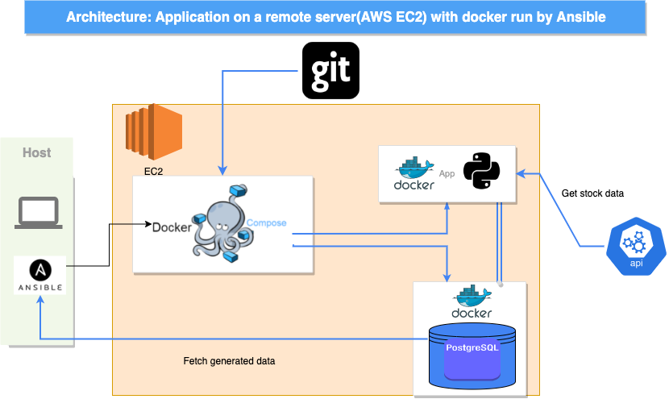
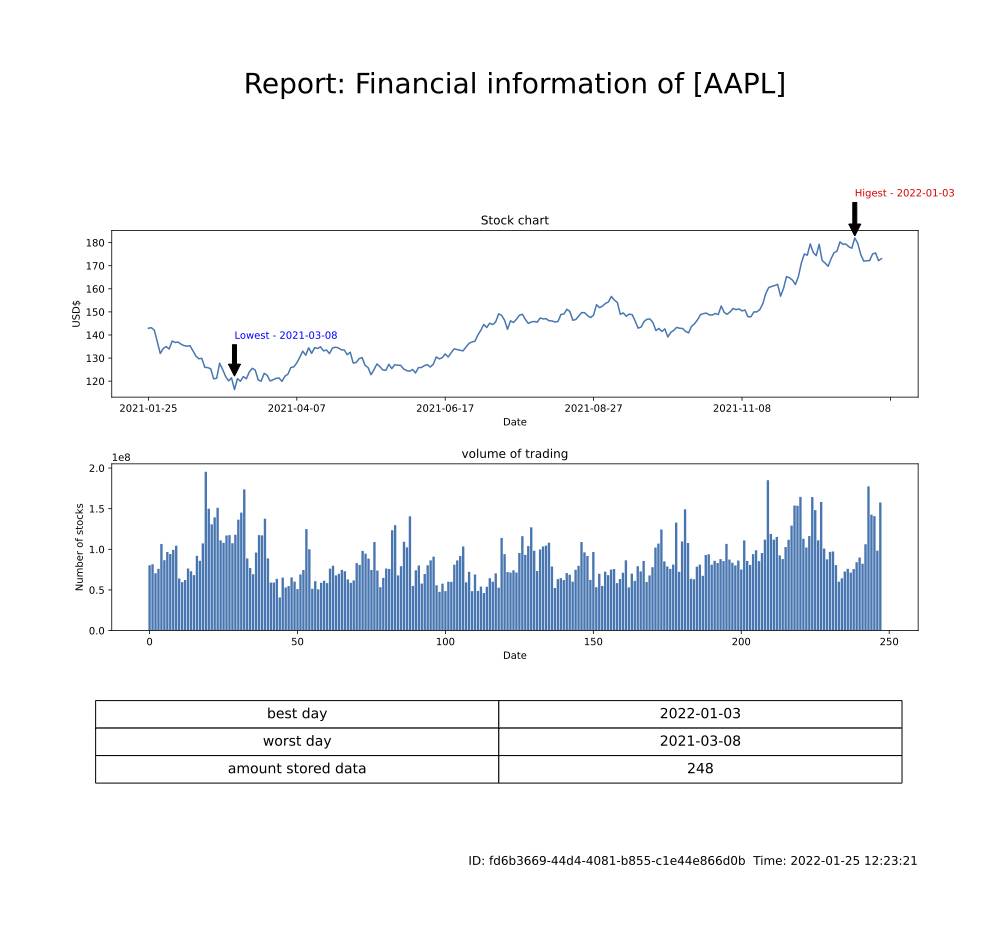
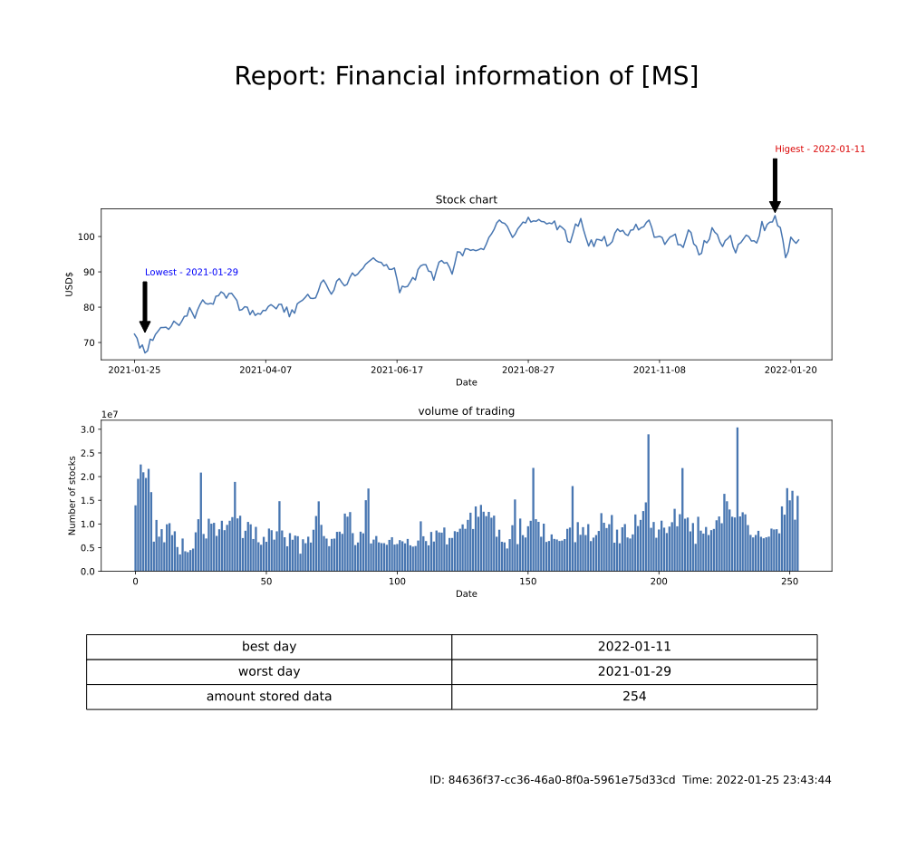

# Running APP-DB server with Ansible + Docker

<br><br>


<p align="center">
  
</p>

<br>

## EC2 server is up and running now.
Flask webpage sample with stoc price.
> http://ec2-44-202-26-113.compute-1.amazonaws.com:5000 <br>

Download a generated report for AAPL
> http://ec2-44-202-26-113.compute-1.amazonaws.com:5000/report <br>

Download a generated report for other companies. (Microsoft here)
> http://ec2-44-202-26-113.compute-1.amazonaws.com:5000/download/MS 


## Part 1. Programming in Python

- use public REST API to get financial historic data about AAPL stocks 
> Using marketstack API(marketstack.com) to get financial historic data\
> With their free plan, 100 requests are free / month (marketstack.com/product)
> API key must be store in **.env file**


- store it in Oracle database
> Here we are using Postgres. The reason that I've chosen this db is to ease local test on my machine (Mac M1, ARM64)\
> Specifically, we are using postgres:14 for Postgres docker image.


- generate a report from stored data:
    - amount of stored data
    - worst stock day
    - best stock day
    - draw a chart

> Using Pandas to cleaning data and directly store it to DB(Postgres) server.\
> Using Matplotlib to draw a chart and table, adding unique ID and generated time at the bottom.\
> Using Flask to serve a webpage for clients to download a generated report.


### Generated report sample

<p align="center">
  
</p>
<br>

### Plus... We can query other companies (e.g., MS)
Type /download/COMPANY_SYMBOL \
e.g.,
```
ec2 .....:5000/download/MS
ec2 .....:5000/download/OTHER_COMPANY_SYMBOL
```
<p align="center">
  
</p>
<br>

## Part 2. Automation

### Use Ansible: <br>
- to install database client on "app server"
> Database is up and running in our **docker environment**.

- to create table, generate sample data in database
> Done with **community.postgresql.postgresql_query** + our sql code **(sql/generate_1m.sql)**.

- to execute code to retrieve subset (first 100 rows) of generated data from database thought "app-server" in CVS  format
> App server is up and running on EC2 instance. We run **app/retrieve_subset.py** in a playbook **retrieve_subset-1m-playbook.yml**

- store gathered data on ansible server file /tmp/gathered_data.csv
> Fetch data with ansible.builtin.fetch in **store-gathered-data-to-ansible.yml**\


<br>

### Information about table and sample data:

#### at least 3 columns: type of number, date, character (size 100 bytes)
- Sample table looks like 

|Column name|Type| Bytes|
|---|---|---|
|uuid|UUID|16|
|date|DATE|4|
|numb|REAL|4|
|text|VARCHAR|10|

- Our generated data (sample)

|uuid|datet|numb|text|
|------|------|------|------|
|02034e79-cf2d-4392-9b3f-7e15563168ab|2022-01-26|180.947|e9d1a3add|
|768d91ef-7acc-4789-a85f-8c8add078dfe|2022-01-27|138.033|003a7182d|
|17021aeb-2b3b-4be2-8883-8ad2aedbe2f5|2022-01-28|5.209	|d13310273|
|6e8e80fd-6369-498b-8a84-739e6153e5f8|2022-01-29|66.373	|a8328bb1b|
|9d84131b-fb1f-42d2-96b3-8cd353fdb924|2022-01-30|72.499	|48ab1061f|


<br>

## Demo: reproduce same result
Environment
>Local machine(Ansible): MacBook Air (M1)\
EC2 instance: Ubuntu Server 20.04 LTS (HVM), SSD Volume Type(64-bit (x86)

<iframe width="560" height="315" src="https://www.youtube.com/embed/8xaU6H1pz1Q" title="YouTube video player" frameborder="0" allow="accelerometer; autoplay; clipboard-write; encrypted-media; gyroscope; picture-in-picture" allowfullscreen></iframe>


## How to run (on local machine):
#### First, we need to install below packages to run ansible on our host side.
1. ansible
2. "psycopg2" or alternative "psycopg2-binary"
3. community.postgresql (with `$ansible-galaxy collection install community.postgresql`)

#### Then, need
1. AWS pem key
2. ".env" file which contains credential data for DB and API
3. Setting "inventory.yml" provide **proper remote IP address**
4. Create "vault.yml" and ".vaultpass"  with (`$ansible-vault create vault.yml`)

#### Then run with
```
ansible-playbook run-all-playbook.yml -i inventory-new.yml --vault-password-file .vaultpass
```
---
#### You can run docker-compose on your local machine instead of running cloud servers.
`$docker-copose up`

#### Build docker image and running **[Not recommended]**
`$docker-compose up --build`

---
## Issues
There are some issues behind of scenes.

1. Building docker image on Mac m1 and shipping to intel/amd64 based system caused some problems
> Solved by building two docker images for each arch arm64 and intel/amd64

2. Building docker image with python dependencies takes **REALLY** long time, possibly up to 15-20 min
> I prebuilt and push it to the docker image on https://hub.docker.com/repository/docker/sungmindocker/skeleton \
> Just pull this image in the docker-compose file
> > However, you can build a docker image yourself and run docker-compose. Use "build" option in "docker-compose.yml" instead of "image".


